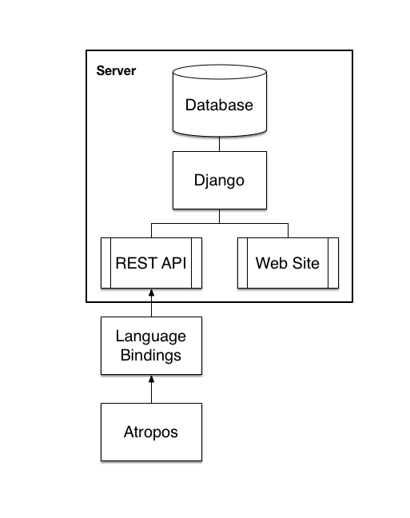

# AdapterBase

## Background

Adapters are short sequences that are attached to cDNA templates during preparation of next generation sequencing (NGS) libraries. Depending on the preparation of the NGS library and how it is sequenced, the raw NGS data may be contaminated with the adapter sequences. See [Didion et al. 2017](https://peerj.com/preprints/2452/) for more details.

Adapter trimming is a critical component of NGS data preprocessing. To trim adapters appropriately, it is necessary to know the sequences of the adapters that were used. However, adapter sequences are poorly documented and often are not included in the metadata of public database submissions ([SRA](http://www.ncbi.nlm.nih.gov/sra), [ENA](http://www.ebi.ac.uk/ena), and [DDBJ](http://www.ddbj.nig.ac.jp)).

### Target Users

AdapterBase is designed to make life easier for scientists who want to re-analyze data from the SRA. The goal is to be able to enter a run accession number (eg. SRR123456) into either the web interface or the command-line API and get out the sequences of the adapters that were used to create the library. This information will also eventually be exposed via Python bindings, so that adapter trimming programs like Atropos can access them directly.

Because a database is only as useful as the quality of the data in it, we also provide the ability for the groups doing the sequencing to create entries for their data in AdapterBase at the same time as depositing it in the SRA/ENA/DDBJ. We have begun to prepopulate the database with annotations of existing data done by automatic detection of adapters using [Atropos](https://github.com/jdidion/atropos). Similarly, we have extracted lists of kits and adapter sequences have been extracted from [Illumina's documentation](https://support.illumina.com/content/dam/illumina-support/documents/documentation/chemistry_documentation/experiment-design/illumina-adapter-sequences_1000000002694-01.pdf), and users can add data for other kits as available.

## System Design

AdapterBase is implemented in SQLite3 and Django with the primary API implemented in REST. Access to the database is via web (URL TBD), command line, and/or Python bindings.

## Usage

Currently, AdapterBase can be accessed from the Hackathon AWS instance by mapping port 80 back to the local host. A permanent, publically facing home will be determined later. To use the AWS instance, please see [these instructions](AWSDEMO.md).

### Local installation

If you want to spin up a local copy of AdapterBase:

1. Make sure python3 is installed
2. Clone or download this git repository
3. From the oadb directory, enter `./buildoadb.sh -v venv`
4. From the oadb directory, enter `./runoadb.sh -v venv` 
5. Open a new broswer tab and navigate to `http://localhost:8000`

These scripts are for simplicity, you can examine them to see what they do.

### Docker installation

You can build a docker image using the following incantations:

    sudo docker pull ubuntu:16.04
    sudo docker build -t oadb:latest .

You can start the application in the background using the following incantation:

    sudo docker run -d -p 8000:8000 --name oadb oadb:latest

As before, open a new browser and navigate to `http://localhost:8000`

    sudo docker run -d -p 8000:8000 --name oadb oadb:latest

### Web interface vignettes

#### Get adapter sequences used by a run from the accession number

#### Deposit adapter information for a run

#### Adding new kits and/or adapter sequences

### Using the Commandline API

### Using Python bindings

## Remaining Goals

1. Complete implementation of website/API
2. Pre-populate Run database from SRA using Atropos
3. Find a home for web implementation and build Docker image
4. User group implementation and security features

### Stretch goals/post-hackathon

5. Continue building out run database with manual curation of SRA datasets
6. Integrate the AdpaterBase API into Atropos
7. Develop a script to scan a set of SRA accessions for adapters and match identified adapter names against the LIBRARY_CONSTRUCTION_PROTOCOL block in the SRA metadata.
 
## Manuscript

A draft manuscript describing AdapterBase may be found [here](https://docs.google.com/document/d/1MefhJkUDHlx5zbiIymqCaFHPAOzTIfC0We6qj2aUAY8/edit?usp=sharing).

## Project Team

AdapterBase was intitially developed as part of an NCBI-sponsored hackathon at the National Library of Medicine, August 14-16th, 2017.
- John P Didion (project lead), NHGRI/NIH, john.didion@nih.gov
- Dan Davis, Systems/Applications Architect, OCCS/AB, NLM, NIH, daniel.davis@nih.gov
- Scott Lewis, Pulmonary Critical Care Medicine, Washington University in St. Louis, slewis3827@gmail.com
- Chaim A Schramm, Vaccine Research Center, NIAID, NIH, chaim.schramm@nih.gov
- Vamsi Vungutur OCCS/AB NLM, NIH vamsi.vungutur@nih.gov
